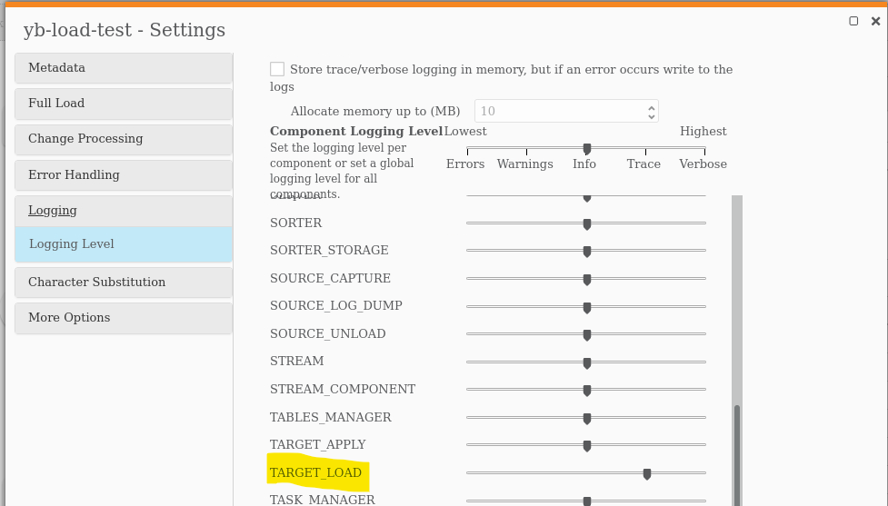
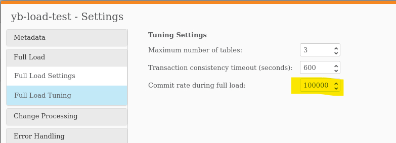
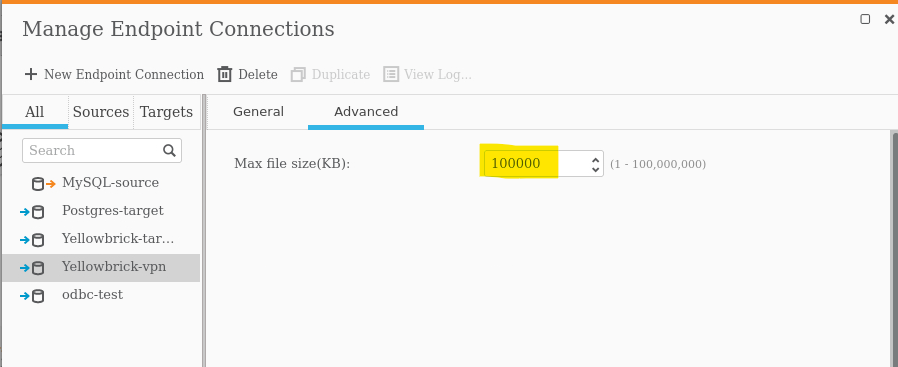
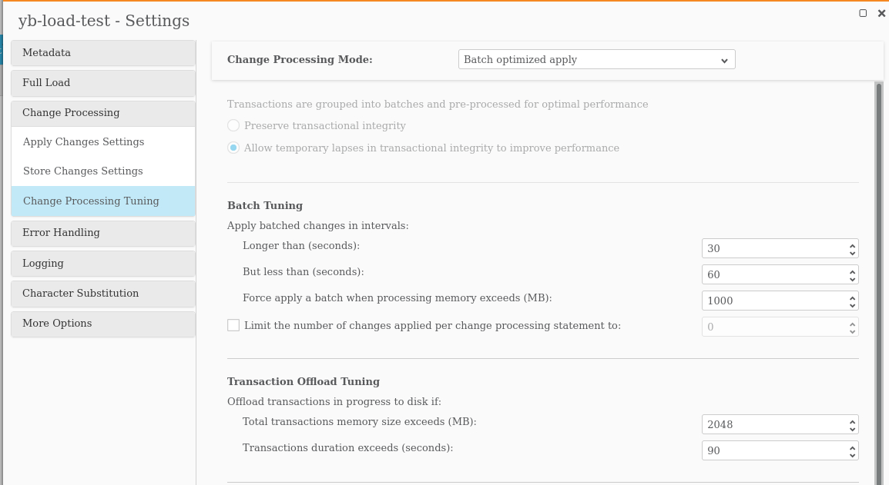

# Configuring Qlik Replicate for Delivery to Yellowbrick

Qlik Replicate supports delivery to native delivery to PostgreSQL databases, including 
Yellowbrick. However, Yellowbrick has some minor differences from "vanilla" Postgres
that we need to alter the default configuration for.

## Qlik Replicate Provider Syntax

For most target databases, Qlik Replicate not surprisingly uses ODBC to interact with 
the database. For these databases, Qlik Replicate uses a JSON-based configuration file
called a **provider syntax** that instructs Replicate about data types, how to perform 
certain actions, etc. A provider syntax can be used to define a target endpoint for
databases that Replicate does not support directly. 

However, due to the generic nature of these files, Qlik Replicate is unable to interact
optimally with all databases. Some targets make use of a hybrid approach, where the provider
syntax provide some information to Replicate, while other actions are implemented directly
in the code. The PostgreSQL endpoint is an example of this hybrid approach. It is for this
reason that we opted to use the PostgreSQL target rather than simply creating a provider
syntax specific to Yellowbrick using the general purpose ODBC target endpoint.

## Modifications to the PostgreSQL Provider Syntax

There are only a couple of tweaks to the PostgreSQL provider syntax needed to optimally
interact with Yellowbrick.

### Override LOB Data Types

The first change is related to LOB-types and is absolutely required. Unlike PostgreSQL, 
Yellowbrick does not support large objects and it has a maximum row size of 64 KB. 
As a result, we need to make an alteration in the data type section of the provider syntax file.

Before:

```json
	"data_type_mapping":	[{
			"rep_type":	"kAR_DATA_TYPE_BOOL",
			"provider_data_type":	"BOOL"
		}, {
			"rep_type":	"kAR_DATA_TYPE_BYTES",
			"provider_data_type":	"BYTEA"
		}, {
			"rep_type":	"kAR_DATA_TYPE_DATE",
			"provider_data_type":	"DATE"
		}, {
			"comment":	"*** lines delete for brevity ***",
		}, {
			"rep_type":	"kAR_DATA_TYPE_WSTR",
			"provider_data_type":	"VARCHAR(${LENGTH})"
		}, {
			"rep_type":	"kAR_DATA_TYPE_BLOB",
			"provider_data_type":	"BYTEA"
		}, {
			"rep_type":	"kAR_DATA_TYPE_NCLOB",
			"provider_data_type":	"text"
		}, {
			"rep_type":	"kAR_DATA_TYPE_CLOB",
			"provider_data_type":	"text"
		}]
```

After:

```json
	"data_type_mapping":	[{
			"rep_type":	"kAR_DATA_TYPE_BOOL",
			"provider_data_type":	"BOOL"
		}, {
			"rep_type":	"kAR_DATA_TYPE_BYTES",
			"provider_data_type":	"VARCHAR"
		}, {
			"rep_type":	"kAR_DATA_TYPE_DATE",
			"provider_data_type":	"DATE"
		}, {
			"comment":	"*** lines delete for brevity ***",
		}, {
			"rep_type":	"kAR_DATA_TYPE_WSTR",
			"provider_data_type":	"VARCHAR(${LENGTH})"
		}, {
			"rep_type":	"kAR_DATA_TYPE_BLOB",
			"provider_data_type":	"VARCHAR"
		}, {
			"rep_type":	"kAR_DATA_TYPE_NCLOB",
			"provider_data_type":	"VARCHAR(62000)"
		}, {
			"rep_type":	"kAR_DATA_TYPE_CLOB",
			"provider_data_type":	"VARCHAR(62000)"
		}]
```


### Override the Bulk Loader

The second change is related to the full load phase of replication and is not strictly 
required. By default, Qlik Replicate will use the `psql` copy command to perform 
bulk loading of the target tables. Yellowbrick supports `psql` directly. This is quite
functional, but not necessarily optimal for large databases that contain large tables.
Yellowbrick provides a native loader, `ybload`, that can provide performance improvements
when loading large tables.

Our approach to overriding the default loader involves replacing `psql` in the
provider syntax with a shell script that is invoked in its place. We needed to call a
shell script rather than `ybload` directly because the hybrid approach taken by the
PostgreSQL target endpoint doesn't allow us to override the command line arguments 
that are passed via the command line. We rely on the shell script to parse the 
command line it is passed and format as needed in order to call `ybload`.

Before:

```json
	"query_syntax":	{
		"comment":	"*** lines delete for brevity ***",
		"load_data_exe_name":	"psql",
		"comment":	"*** lines delete for brevity ***",
	},
```

After: 

```json
	"query_syntax":	{
		"comment":	"*** lines delete for brevity ***",
		"load_data_exe_name":	"ybload.sh",
		"comment":	"*** lines delete for brevity ***",
	},
```


## Differences Between Windows and Linux Hosts

While the approach taken for both Windows and Linux Qlik Replicate hosts is
essentially the same, the shell scripts are obviously different (Windows batch 
files vs. Linux bash scripts). There are some also some minor 
differences in behavior of the PostgreSQL target endpoint with regard to the provider
syntax. The subdirectories in this repository provide details for both
Windows and Linux hosts.

## Best Practice Recommendations

* Set the **task** logging level for *TARGET_LOAD* to *TRACE* in order to see detailed output 
from `ybload` when troubleshooting.


* Set *Full Load Tuning* commit rate to 100,000 or larger from the default of 10,000
to take better advantage of the throughput benefits of `ybload`.


* Configure the target endpoint to allow transfer of larger files. 


* Configure the task to allow for larger batches.


