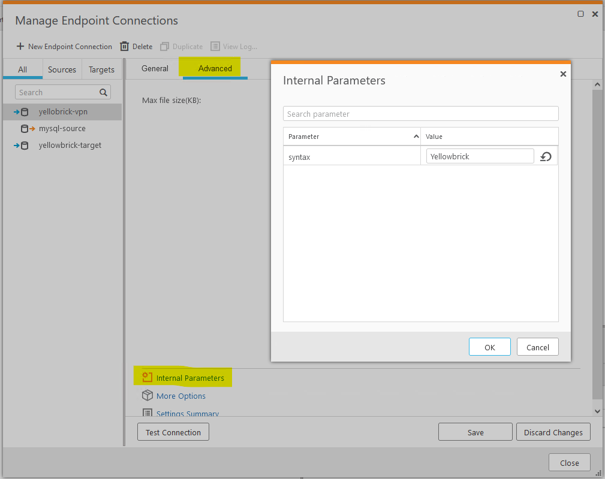

# Configuring a Replicate Windows Host 

It is a straightforward process configure Qlik Replicate installed on a Windows host.
There are just a few steps:

* Install the Yellowbrick tools package.
* Install the `ybload.bat` script in the Qlik Replicate `bin` directory. 
* Upload a new provider syntax for PostgreSQL that addresses the differences that
Yellowbrick has from vanilla PostgreSQL.
* Configure your Yellowbrick target endpoint.

## Install the Yellowbrick Tools Package

Once you have downloaded the Yellowbrick tools from Yellowbrick to the Replicate
windows host, install the package as directed.

By default, the *ybtools* package will be installed at 
*C:\Program Files\Yellowbrick Data\Client Tools*.

> Note: `ybload` has a dependency on Java 1.8. If it is not already installed on 
> your system, you will need to install it now. Be sure that you also set
> `JAVA_HOME` as appropriate in your system environment so that `ybload.bat` will pick it up.

## Install ybload.bat 

Next, we need to copy the `ybload.bat` script into the Qlik Replicate *bin* directory. 
If you took the defaults when installing Qlik Replicate, the *bin* directory is located
at `C:\Program Files\attunity\replicate\bin`.

## Upload a New Provider Syntax for PostgreSQL

Finally, we need to upload a version of the provider syntax for PostgreSQL that is
specific to Yellowbrick. 

First, you need to copy the *yellowbrick-ybload-win.json* file to the Replicate *data*
directory. By default, the Replicate *data* directory can be found at 
*C:\Program Files\attunity\replicate\data*, 
but customers frequently place the data directory elsewhere. The examples below specify the
location of the Replicate *data* directory. If you have left it in default location,
you can safely omit the `-d <directory>` option below.

> Note: be sure that you do **not** include the `.json` suffix when you specify the 
> file name below.


```
PS C:\Program Files\attunity\replicate\bin>
PS C:\Program Files\attunity\replicate\bin> repctl.exe -d C:\data putobject data=yellowbrick-ybload-win
[putobject command] Succeeded
PS C:\Program Files\attunity\replicate\bin>
```

Finally, double check to be sure that Replicate successfully installed the *Yellowbrick*
provider syntax by retrieving it here and examining the contents to ensure that
`ybload.bat` is specified.


```
PS C:\Program Files\attunity\replicate\bin>
PS C:\Program Files\attunity\replicate\bin> repctl.exe -d C:\data getprovidersyntax syntax_name=Yellowbrick
command getprovidersyntax response:
{
        "provider_syntax":      {
                "name": "Yellowbrick",
                "query_syntax": {
                        "create_primary_key":   "ALTER TABLE ${QO}${TABLE_OWNER}${QC}.${QO}${TABLE_NAME}${QC} ADD PRIMARY KEY ( ${COLUMN_LIST} )",
                        "modify_column":        "ALTER TABLE ${QO}${TABLE_OWNER}${QC}.${QO}${TABLE_NAME}${QC} ALTER COLUMN ${QO}${COLUMN_NAME}${QC} SET DATA TYPE ${COLUMN_TYPE}",
                        "error_code_constraint_violation":      "23000,23502,23505",
                        "bulk_update_syntax":   "FROM_AT_THE_END",
                        "csv_null_value":       "attNULL",
                        "load_data_exe_name":   "ybload.bat",
       *** snip - lines deleted for brevity ***
        }
}
[getprovidersyntax command] Succeeded
PS C:\Program Files\attunity\replicate\bin>
```

## Configure Your Yellowbrick Target Endpoint

Things are now ready for you to configure a PostgreSQL target endpoint that will deliver
data to Yellowbrick.

Unlike on Linux where we were required to physically replace the PostgreSQL provider syntax,
on Windows we are able to install a separate provider syntax specific to Yellowbrick.
In order to cause the target endpoint to use the new provider syntax, we need to set
a Qlik Replicate *internal parameter* to override the default provider syntax (*PostgreSQL*)
with the provider syntax that is specific to Yellowbrick. You will do this by
selecting the `Advanced` tab in the PostgreSQL target endpoint, then selecting 
`Internal Parameters`, and finally entering a parameter `syntax` with the value `Yellowbrick`.



> The value you enter is case sensitive. Note that the value above is `Yellowbrick` with a 
> capital 'Y'.

Other than that, configure just as you would any PostgreSQL target. 
In order for `ybload` to run, be sure that you are connecting
to the hostname or IP address of a Yellowbrick instance that supports high speed connectivity
and has the requisite ports that `ybload` depends on open.


